# Master Data Creation & Dependency Workflow

> Reference for seeding / testing every module under `http://localhost:3000/master/<moduleKey>`.
>
> **Source of truth:** `src/config/modules.js` — the registry that drives every
> `/master/:moduleKey` route (`src/App.js`, `<Route path=":moduleKey" element={<GenericCrudPage />} />`).
> Each field's `reference:` property is the foreign-key link that defines the dependency graph.

**Key rule:** All relational (`select`) fields are strictly `required` **except one** —
`costInfos.TaxGroupId` is optional. So **Cost Info is technically a Level‑0 base table**
(only `Amount` is mandatory); **Tax Groups** is only needed if you attach a tax group.
Depths below reflect *required-only* prerequisites.

---

## 1. Chronological Creation Sequence

Seed strictly top-to-bottom. Everything in a step depends only on earlier steps.

**Step 1 — Level 0 · Base tables (no prerequisites, any order):**
`taxTypes` · `uom` · `categories` · `taxGroups` · `organizations` · `accountTypeBases` ·
`transactionTypeConfigs` · `transactionTypeStatuses` · `contactAddressTypes` ·
`locationDetails` · `mapProviders` · `paymentReceivedTypes` · `paymentModes` · `costInfos`¹

**Step 2 — Level 1 · Single-hop dependents:**
`uomFactors` · `taxGroupTaxTypeMappers` · `transactionTypes` · `transactionTypeBaseConversions` ·
`contactDetails` · `mapProviderLocationMappers` · `paymentModeTransactionDetails` · `itemDetails`

**Step 3 — Level 2:** `addressDetails` *(needs mapProviderLocationMappers)*

**Step 4 — Level 3:** `branchDetails` *(needs addressDetails + contactDetails + organizations + transactionTypeConfigs)*

**Step 5 — Level 4:** `transactionDetailLogs` · `branchUserGroupMappers` · `batchDetails` *(all need branchDetails)*

**Step 6 — Level 5:** `transactionItemDetails` · `transactionTypeConversionMappers` · `paymentDetails` *(all need transactionDetailLogs)*

**Step 7 — Level 6 · Deepest compound:** `paymentBreakups` *(needs paymentDetails + 3 others)*

¹ `costInfos` is safe at Step 1, but **seed `taxGroups` first if you intend to attach a tax group** to a cost record.

---

## 2. Master Dependency Matrix Table

`*` = mandatory field. Relational fields (which drive dependencies) are shown with their source module in the Prerequisites column.

| Component Name | Route / URL | Required Input Fields | Direct Prerequisite Modules | Depth |
| :--- | :--- | :--- | :--- | :---: |
| Tax Types | `/master/taxTypes` | Name*, Value* | None | 0 |
| Units of Measure (UOM) | `/master/uom` | UnitName*, IsPrimary | None | 0 |
| Categories | `/master/categories` | Name* | None | 0 |
| Tax Groups | `/master/taxGroups` | Name* | None | 0 |
| Organizations | `/master/organizations` | Name* | None | 0 |
| Account Type Bases | `/master/accountTypeBases` | Name* | None | 0 |
| Transaction Configs | `/master/transactionTypeConfigs` | StartCounterNo*, Format*, Prefix, TagName | None | 0 |
| Transaction Statuses | `/master/transactionTypeStatuses` | Name* | None | 0 |
| Address Types | `/master/contactAddressTypes` | Name* | None | 0 |
| Location Details | `/master/locationDetails` | Lat*, Lng*, CF1–CF4 | None | 0 |
| Map Providers | `/master/mapProviders` | ProviderName* | None | 0 |
| Payment Received Types | `/master/paymentReceivedTypes` | Type* | None | 0 |
| Payment Modes | `/master/paymentModes` | Type* | None | 0 |
| Cost Info | `/master/costInfos` | Amount*, ~~TaxGroupId~~(opt), IsTaxIncluded | Tax Groups *(optional)* | 0¹ |
| UOM Factors | `/master/uomFactors` | Factor*, **PrimaryUOM***, **SecondaryUOM*** | UOM ×2 | 1 |
| Tax Group Mappers | `/master/taxGroupTaxTypeMappers` | **TaxGroup***, **TaxType*** | Tax Groups, Tax Types | 1 |
| Transaction Types | `/master/transactionTypes` | Name*, **TransactionConfig*** | Transaction Configs | 1 |
| Base Conversions | `/master/transactionTypeBaseConversions` | **Config***, **FromStatus***, **ToStatus***, Tag | Transaction Configs, Transaction Statuses ×2 | 1 |
| Contact Details | `/master/contactDetails` | FirstName*, **AddressType***, phones | Address Types | 1 |
| Location Mappers | `/master/mapProviderLocationMappers` | **MapProvider***, **LocationDetail***, TagName | Map Providers, Location Details | 1 |
| Payment Transactions | `/master/paymentModeTransactionDetails` | **PaymentMode***, RefNo, CF1–CF4 | Payment Modes | 1 |
| Item Details | `/master/itemDetails` | Name*, **Category***, **UOM***, **CostInfo***, SKU, Barcode, HSN | Categories, UOM, Cost Info | 1 |
| Address Details | `/master/addressDetails` | AddressLine1*, **AddressType***, **LocationMapper***, City, State, Pincode | Address Types, Location Mappers | 2 |
| Branch Details | `/master/branchDetails` | BranchName*, **Address***, **Contact***, **Organization***, **TxnConfig***, TIN/GSTIN/PAN | Address Details, Contact Details, Organizations, Transaction Configs | 3 |
| Branch User Groups | `/master/branchUserGroupMappers` | **Branch***, UserGroupId* (ext.) | Branch Details | 4 |
| Transaction Logs | `/master/transactionDetailLogs` | TransactionNo*, **Config***, **Status***, **Branch***, Date, Remarks | Transaction Configs, Transaction Statuses, Branch Details | 4 |
| Batch Details | `/master/batchDetails` | BatchNo*, MfgDate*, Expdate*, PurchaseDate*, Qty*, **CostInfo***, **UOM***, **LocationMapper***, **Branch*** | Cost Info, UOM, Location Mappers, Branch Details | 4 |
| Transaction Item Details | `/master/transactionItemDetails` | **TransactionLog***, **Item***, Comment | Transaction Logs, Item Details | 5 |
| Conversion Mappers | `/master/transactionTypeConversionMappers` | **BaseConversion***, **TransactionLog***, **Status*** | Base Conversions, Transaction Logs, Transaction Statuses | 5 |
| Payment Details | `/master/paymentDetails` | **AccountTypeBase***, **TransactionLog***, GrossAmount*, TotalAmount* | Account Type Bases, Transaction Logs | 5 |
| Payment Breakups | `/master/paymentBreakups` | **AccountTypeBase***, **PaymentDetail***, **PaymentTxn***, **PaymentReceivedType***, Timestamp* | Account Type Bases, Payment Details, Payment Transactions, Payment Received Types | 6 |

¹ Independent for a minimal record; becomes Level 1 (needs Tax Groups) when a tax group is attached.

> **Note — POS masters:** `posChannel` (`/api/pos/channels`) and `posVariant` (`/api/pos/variants`)
> also exist in this registry (both Level 0, independent) but have **no `category`**, so they are
> intentionally excluded from the `/master` sidebar — they are surfaced under **Front Desk**
> (`/frontdesk/channels`, `/frontdesk/variants`) and act as reference lookups for the Menu form.

---

## 3. Visual Lineage Diagram

```mermaid
graph TD
    %% ===== Level 0: Base tables =====
    taxTypes["Tax Types (L0)"]
    uom["UOM (L0)"]
    categories["Categories (L0)"]
    taxGroups["Tax Groups (L0)"]
    organizations["Organizations (L0)"]
    accountTypeBases["Account Type Bases (L0)"]
    txnConfigs["Transaction Configs (L0)"]
    txnStatuses["Transaction Statuses (L0)"]
    addrTypes["Address Types (L0)"]
    locationDetails["Location Details (L0)"]
    mapProviders["Map Providers (L0)"]
    payRecvTypes["Payment Received Types (L0)"]
    payModes["Payment Modes (L0)"]
    costInfos["Cost Info (L0*)"]

    %% ===== Level 1 =====
    uomFactors["UOM Factors (L1)"]
    taxGroupMappers["Tax Group Mappers (L1)"]
    txnTypes["Transaction Types (L1)"]
    baseConversions["Base Conversions (L1)"]
    contactDetails["Contact Details (L1)"]
    locMappers["Location Mappers (L1)"]
    payModeTxn["Payment Transactions (L1)"]
    itemDetails["Item Details (L1)"]

    %% ===== Level 2-3 =====
    addressDetails["Address Details (L2)"]
    branchDetails["Branch Details (L3)"]

    %% ===== Level 4 =====
    txnLogs["Transaction Logs (L4)"]
    branchUserGroups["Branch User Groups (L4)"]
    batchDetails["Batch Details (L4)"]

    %% ===== Level 5 =====
    txnItemDetails["Transaction Item Details (L5)"]
    conversionMappers["Conversion Mappers (L5)"]
    paymentDetails["Payment Details (L5)"]

    %% ===== Level 6 =====
    paymentBreakups["Payment Breakups (L6)"]

    %% ---- Edges (prerequisite --> dependent) ----
    uom --> uomFactors
    taxGroups --> taxGroupMappers
    taxTypes --> taxGroupMappers
    txnConfigs --> txnTypes
    txnConfigs --> baseConversions
    txnStatuses --> baseConversions
    addrTypes --> contactDetails
    mapProviders --> locMappers
    locationDetails --> locMappers
    payModes --> payModeTxn
    categories --> itemDetails
    uom --> itemDetails
    costInfos --> itemDetails

    %% Fixed syntax for optional link to render correctly in all viewers
    taxGroups -.->|optional| costInfos

    addrTypes --> addressDetails
    locMappers --> addressDetails

    addressDetails --> branchDetails
    contactDetails --> branchDetails
    organizations --> branchDetails
    txnConfigs --> branchDetails

    branchDetails --> branchUserGroups
    txnConfigs --> txnLogs
    txnStatuses --> txnLogs
    branchDetails --> txnLogs
    costInfos --> batchDetails
    uom --> batchDetails
    locMappers --> batchDetails
    branchDetails --> batchDetails

    txnLogs --> txnItemDetails
    itemDetails --> txnItemDetails
    baseConversions --> conversionMappers
    txnLogs --> conversionMappers
    txnStatuses --> conversionMappers
    accountTypeBases --> paymentDetails
    txnLogs --> paymentDetails

    accountTypeBases --> paymentBreakups
    paymentDetails --> paymentBreakups
    payModeTxn --> paymentBreakups
    payRecvTypes --> paymentBreakups
```

**Critical path (longest chain, 7 tiers):**
`Map Providers / Location Details → Location Mappers → Address Details → Branch Details → Transaction Logs → Payment Details → Payment Breakups`.

- `paymentBreakups` is the **last** seedable module.
- `branchDetails` is the **pivotal hub** that unblocks the entire transaction + payment subtree.
